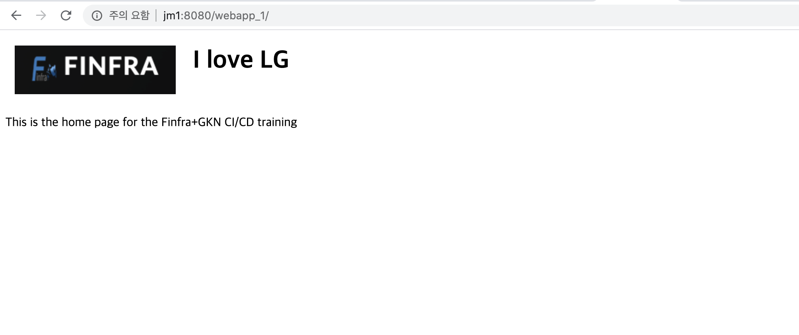

# So1
## Description
- Git 레포지터리 https://bitbucket.org/jgnam/webapp.git fork
- Git 레포지터리 https://bitbucket.org/limp666/webapp.git 의 소스코드를 Jenkins를 통해 Build
- Build된 war 파일을 jenkins로 톰캣서버로 전송하는 파이프 라인 생성
- Source code 변경 (I love LG --> I love KT)

## UI Result images
- Build에 성공한 Jenkins UI 이미지


- Tomcat Server의 Admin화면





- Source code change
```
           
         </td>
         <td>
-          <h1>I love LG</h1>
+          <h1>I love KT</h1>
         </td>
       </tr>
     </table>
```


## config.xml files (webapp, webapp_deployment)
- /var/lib/jenkins/jobs/webapp/config.xml
```
<?xml version='1.1' encoding='UTF-8'?>
<project>
  <actions/>
  <description>webapp</description>
  <keepDependencies>false</keepDependencies>
  <properties/>
  <scm class="hudson.plugins.git.GitSCM" plugin="git@4.2.2">
    <configVersion>2</configVersion>
    <userRemoteConfigs>
      <hudson.plugins.git.UserRemoteConfig>
        <url>https://bitbucket.org/limp666/webapp.git</url>
      </hudson.plugins.git.UserRemoteConfig>
    </userRemoteConfigs>
    <branches>
      <hudson.plugins.git.BranchSpec>
        <name>*/master</name>
      </hudson.plugins.git.BranchSpec>
    </branches>
    <doGenerateSubmoduleConfigurations>false</doGenerateSubmoduleConfigurations>
    <submoduleCfg class="list"/>
    <extensions/>
  </scm>
  <canRoam>true</canRoam>
  <disabled>false</disabled>
  <blockBuildWhenDownstreamBuilding>false</blockBuildWhenDownstreamBuilding>
  <blockBuildWhenUpstreamBuilding>false</blockBuildWhenUpstreamBuilding>
  <triggers/>
  <concurrentBuild>false</concurrentBuild>
  <builders>
    <hudson.tasks.Shell>
      <command>mvn package</command>
    </hudson.tasks.Shell>
  </builders>
  <publishers>
    <hudson.tasks.ArtifactArchiver>
      <artifacts>multi3/target/*.war</artifacts>
      <allowEmptyArchive>false</allowEmptyArchive>
      <onlyIfSuccessful>false</onlyIfSuccessful>
      <fingerprint>false</fingerprint>
      <defaultExcludes>true</defaultExcludes>
      <caseSensitive>true</caseSensitive>
      <followSymlinks>false</followSymlinks>
    </hudson.tasks.ArtifactArchiver>
    <hudson.tasks.BuildTrigger>
      <childProjects>webapp_deployment</childProjects>
      <threshold>
        <name>SUCCESS</name>
        <ordinal>0</ordinal>
        <color>BLUE</color>
        <completeBuild>true</completeBuild>
      </threshold>
    </hudson.tasks.BuildTrigger>
  </publishers>
  <buildWrappers/>
</project>
```

- /var/lib/jenkins/jobs/webapp_deployment/config.xml
```
<?xml version='1.1' encoding='UTF-8'?>
<project>
  <actions/>
  <description></description>
  <keepDependencies>false</keepDependencies>
  <properties/>
  <scm class="hudson.scm.NullSCM"/>
  <canRoam>true</canRoam>
  <disabled>false</disabled>
  <blockBuildWhenDownstreamBuilding>false</blockBuildWhenDownstreamBuilding>
  <blockBuildWhenUpstreamBuilding>false</blockBuildWhenUpstreamBuilding>
  <triggers>
    <jenkins.triggers.ReverseBuildTrigger>
      <spec></spec>
      <upstreamProjects>webapp, </upstreamProjects>
      <threshold>
        <name>SUCCESS</name>
        <ordinal>0</ordinal>
        <color>BLUE</color>
        <completeBuild>true</completeBuild>
      </threshold>
    </jenkins.triggers.ReverseBuildTrigger>
  </triggers>
  <concurrentBuild>false</concurrentBuild>
  <builders>
    <hudson.plugins.copyartifact.CopyArtifact plugin="copyartifact@1.44">
      <project>webapp</project>
      <filter></filter>
      <target></target>
      <excludes></excludes>
      <selector class="hudson.plugins.copyartifact.StatusBuildSelector"/>
      <doNotFingerprintArtifacts>false</doNotFingerprintArtifacts>
    </hudson.plugins.copyartifact.CopyArtifact>
  </builders>
  <publishers>
    <hudson.plugins.deploy.DeployPublisher plugin="deploy@1.15">
      <adapters>
        <hudson.plugins.deploy.tomcat.Tomcat7xAdapter>
          <credentialsId>37a03815-97ad-491d-a103-c558c40458a7</credentialsId>
          <url>http://jm1:8080/</url>
          <path></path>
        </hudson.plugins.deploy.tomcat.Tomcat7xAdapter>
      </adapters>
      <contextPath>webapp_$BUILD_NUMBER</contextPath>
      <war>**/*.war</war>
      <onFailure>false</onFailure>
    </hudson.plugins.deploy.DeployPublisher>
  </publishers>
  <buildWrappers/>
</project>
```
